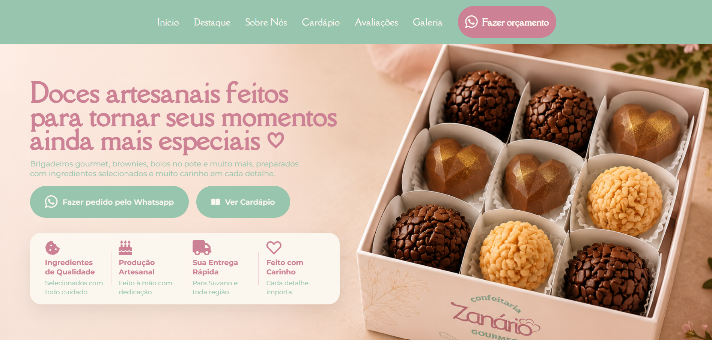

# 🍰 Doces Zanario Gourmet

Uma landing page moderna e responsiva desenvolvida para a **Zanario Gourmet**, uma confeitaria especializada em doces artesanais, bolos e sobremesas.

O projeto foi criado com o objetivo de fortalecer a presença digital da marca, apresentar os produtos de forma atrativa e proporcionar uma experiência agradável aos clientes, utilizando boas práticas de desenvolvimento Front-end, SEO e otimização de performance.

---

## 📷 Preview

<p align="center">
    
</p>

---

## 🚀 Demonstração

🔗 **Acesse o projeto online**

https://zanario-gourmet.vercel.app/

---

## ✨ Funcionalidades

- 🍰 Apresentação institucional da confeitaria
- 📋 Cardápio digital organizado por categorias
- 🖼️ Galeria de produtos
- ⭐ Seção de avaliações de clientes
- 📖 História da empresa
- 📱 Layout totalmente responsivo
- 📞 Botão de contato via WhatsApp
- ⚡ Navegação fluida
- 🎨 Interface moderna
- 🔍 SEO otimizado

---

## 🛠 Tecnologias Utilizadas

<p align="center">

</p>

- HTML5
- CSS3
- JavaScript
- Git
- GitHub
- Vercel

---

## 🎯 Objetivo do Projeto

Este projeto foi desenvolvido para:

- Criar uma presença digital profissional para a Zanario Gourmet.
- Melhorar a divulgação dos produtos.
- Aplicar boas práticas de desenvolvimento Front-end.
- Desenvolver uma interface moderna e intuitiva.
- Praticar responsividade, SEO e otimização de performance.

---

## 📂 Estrutura do Projeto

```text
doces-zanario-gourmet/

├── assets/
│   ├── clientes/
│   ├── doces/
|
├── scripts/
|
├── styles/
│
├── index.html
└── README.md
```

---

## 💻 Como Executar

Clone o repositório

```bash
git clone https://github.com/devKauaHenrique/doces-zanario-gourmet.git
```

Entre na pasta

```bash
cd doces-zanario-gourmet
```

Abra o arquivo

```text
index.html
```

em qualquer navegador.

---

## 📱 Responsividade

O projeto foi desenvolvido para proporcionar uma excelente experiência em diferentes dispositivos:

- 💻 Desktop
- 💼 Notebook
- 📱 Smartphones
- 📲 Tablets

---

## ⚡ Performance

Durante o desenvolvimento foram aplicadas otimizações para melhorar a experiência do usuário, como:

- Estrutura HTML semântica
- Imagens otimizadas
- Código organizado
- Carregamento eficiente de recursos
- Boas práticas de SEO
- Responsividade

---

## 📚 Aprendizados

Este projeto permitiu aprofundar conhecimentos em:

- HTML5 Semântico
- CSS3
- JavaScript
- Responsividade
- UX/UI
- SEO
- Performance Web
- Organização de projetos Front-end

---

## 🎨 Design

O projeto foi desenvolvido seguindo uma identidade visual inspirada na marca Zanario Gourmet, utilizando cores suaves, tipografia elegante e foco na valorização dos produtos.

Princípios utilizados:

- Minimalismo
- Elegância
- Responsividade
- Acessibilidade
- Boa experiência do usuário

---

## 👨‍💻 Autor

**Kauã Henrique**

🌐 **Portfólio**

https://dev-kaua.vercel.app

💼 **LinkedIn**

https://www.linkedin.com/in/kauã-henrique-78259a259/

💻 **GitHub**

https://github.com/devKauaHenrique

---

⭐ Se este projeto foi útil ou serviu como inspiração, considere deixar uma estrela no repositório.